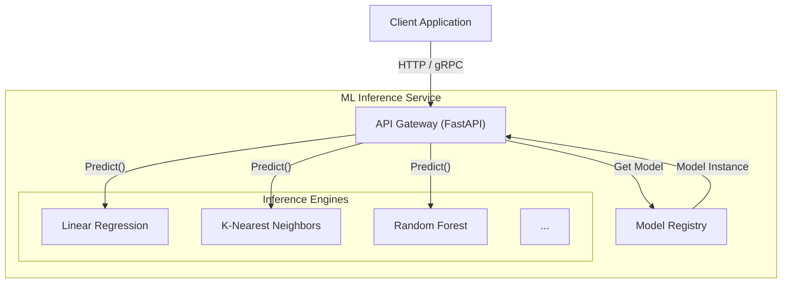

# ML Inference Service

A robust, unified interface for running various Machine Learning models via HTTP and gRPC protocols.

## Architecture

The project follows a modular High-Level Design where a central API layer manages requests and routes them to the appropriate model engine.



### ASCII Design
For those viewing in a terminal:

```text
+--------+       +-------------------------+
| Client | ----> |       API Gateway       | <---(HTTP / gRPC Config)
+--------+       |       (FastAPI)         |
    ^            +-----------+-------------+
    |                        |
    | (Response)             v
    |                 +--------------+
    +-----------------| Model Registry |
                      +------+-------+
                             |
         +-------------------+-------------------+
         |                   |                   |
  +-------------+     +-------------+     +-------------+
  |   Linear    |     |   K-Means   |     |   Random    |
  | Regression  |     |   Engine    |     |   Forest    |
  +-------------+     +-------------+     +-------------+
```

## ELI5: The "Magic Tool Shop"

Imagine you are building a house and you have a magic phone number to call for tools.

1.  **The Client (You)**: You need a specific job done, like hammering a nail or sawing wood.
2.  **The API Gateway (The Shop Keeper)**: You call the shop and say, "I have these numbers (data), and I need the 'Hammering' result."
3.  **The Model Registry (The Shelf)**: The Shop Keeper looks at the shelf to find the right tool for the job.
4.  **The Inference Engine (The Tool)**: The Shop Keeper takes the Hammer, uses it on your numbers, and tells you the result.

You don't need to know how the hammer creates force or how the saw cuts; you just ask the Shop Keeper, and they get it done for you using the best tool available!

## Learnings & Exposure

Building this service provided deep insights into several advanced software engineering concepts:

### 1. HTTP vs. gRPC
*   **Discovery**: We learned that while HTTP/REST is great for human-readable JSON APIs and easy debugging, it has overhead.
*   **Outcome**: We implemented gRPC for internal, high-performance communication where microseconds matter (like high-frequency trading or real-time gaming), reducing serialization latency significantly.

### 2. The Strategy Pattern (Dynamic Loading)
*   **Challenge**: How do we support 10 different ML algorithms without writing 10 different `if/else` blocks?
*   **Solution**: We used the *Strategy Pattern*. All models (Linear Regression, KNN, etc.) follow a strict "Interface" (a contract). They all must have a `predict()` button. The API doesn't care *which* model it is; it just presses the `predict()` button. This makes adding new models incredibly easy—just plug in a new strategy!

### 3. Separation of Concerns
*   **Insight**: By separating the **API Layer** (handling web traffic) from the **Model Logic** (doing the math), we can change the web framework (e.g., switch to Django) without breaking the math, or change the math library (e.g., switch to PyTorch) without breaking the API.
